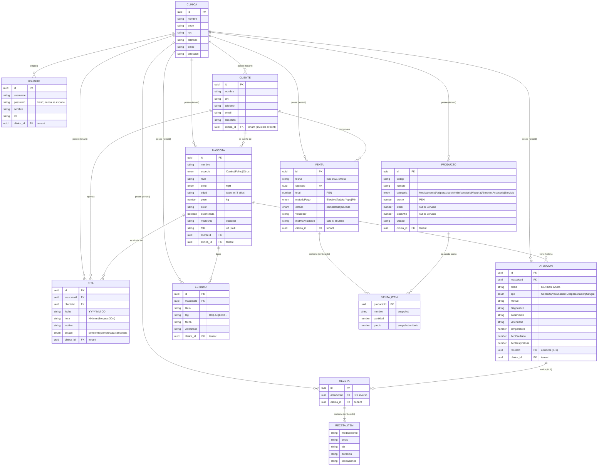

# SIVET — Especificación Técnica del Backend

> **Documento de arquitectura** generado por ingeniería inversa del frontend Angular actual
> (`src/app/core/domain/models/` y `src/app/core/application/services/`).
> Es el **contrato vinculante**: el backend debe respetar exactamente estos esquemas,
> rutas y comportamientos para no romper el cliente existente.
>
> **Stack del cliente:** Angular (standalone + Signals). Base URL actual: `environment.apiUrl = http://localhost:8080`.
> El cliente hoy consume un **json-server** simulado; este documento define cómo el backend real debe sustituirlo *sin tocar el frontend*.

---

## Notas de migración transversales (leer primero)

1. **IDs: de strings secuenciales a UUID v4.**
   Hoy el frontend genera IDs en cliente con prefijo + correlativo: `c1`, `m3`, `p5`, `v12`, `a4`, `r2`, `cita7`.
   Esto es una limitación del mock (json-server) y **debe desaparecer**: el backend será la **única fuente de verdad de los IDs** y devolverá **UUID v4** (`"b3f1c2a4-…"`).
   - El frontend envía hoy un `id` tentativo en el body del `POST`. **El backend debe ignorarlo** y asignar su propio UUID.
   - Como el frontend hace inserción optimista usando el objeto **devuelto** por el POST (`tap((creada) => …)`), basta con que la respuesta traiga el UUID real para que todo siga funcionando. Los IDs tentativos del cliente nunca se persisten si el backend manda los suyos.
   - Todas las llaves foráneas (`clienteId`, `mascotaId`, `productoId`, `atencionId`, `recetaId`, `clinica_id`) pasan a ser **UUID** que referencian al `id` de la entidad destino.

2. **Aislamiento multi-tenant obligatorio.**
   Cada petición autenticada llega con el header `X-Tenant-ID: <veterinaria_id>`. El backend **debe filtrar e insertar** TODOS los recursos por ese tenant (ver §3.1). Ninguna entidad de negocio es global salvo `usuarios`/`clinicas` (que igualmente se resuelven por tenant en el login).

3. **Nomenclatura de rutas.** El frontend llama colecciones **en español y en plural**: `/mascotas`, `/clientes`, `/productos`, `/ventas`, `/citas`, `/atenciones`, `/recetas`, `/estudios`. El backend **debe conservar exactamente estos nombres de recurso** (un alias `/pacientes → mascotas` rompería el cliente). Se recomienda prefijar todo con `/api` *solo si* se actualiza `environment.apiUrl` a `http://host/api` simultáneamente.

4. **Formato de fechas.** Conviven dos formatos según la entidad:
   - ISO 8601 con hora (`"2026-05-24T10:30:00"`) en `Atencion.fecha` y `Venta.fecha`.
   - ISO solo-fecha (`"YYYY-MM-DD"`) en `Cita.fecha`, y `"HH:mm"` en `Cita.hora`.

---

## 1. Diccionario de Datos (Modelos y Esquemas)

Tipos expresados como TypeScript/JSON. **Obligatorio** = el frontend siempre lo envía/espera presente. `?` = opcional. Los `enum` son uniones de string literales: el backend **debe validar** que el valor pertenezca al conjunto.

### 1.1 `Usuario` — colección `usuarios`
Cuenta de acceso. No hay registro público; las crea el administrador. Cada usuario pertenece a **una** clínica (tenant).

| Campo | Tipo | Obligatorio | Notas |
|---|---|:---:|---|
| `id` | `UUID` (string) | ✅ | PK. Lo asigna el backend. |
| `username` | `string` | ✅ | Credencial de login (único por sistema). |
| `password` | `string` | ✅ (solo entrada) | **NUNCA** se expone en respuestas del backend real. Debe almacenarse **hasheado** (bcrypt/argon2). El campo existe en el modelo del front solo por el login simulado. |
| `nombre` | `string` | ✅ | Nombre del profesional. Va al claim `nombre` del JWT. |
| `rol` | `string` | ✅ | p. ej. `"Veterinario"`, `"Admin"`. Va al claim `rol`. |
| `clinica_id` | `UUID` (string) | ✅ | **FK → `Clinica.id`**. Es el Tenant ID del usuario. |

### 1.2 `Clinica` — colección `clinicas`
Perfil del arrendatario (tenant) del SaaS.

| Campo | Tipo | Obligatorio | Notas |
|---|---|:---:|---|
| `id` | `UUID` | ✅ | PK = Tenant ID. |
| `nombre` | `string` | ✅ | Razón comercial. |
| `sede` | `string` | ✅ | Sucursal. |
| `ruc` | `string` | ✅ | RUC (11 dígitos, Perú). |
| `telefono` | `string` | ✅ | |
| `email` | `string` | ✅ | |
| `direccion` | `string` | ✅ | |

### 1.3 `Cliente` — colección `clientes`
Dueño/propietario de mascotas.

| Campo | Tipo | Obligatorio | Notas |
|---|---|:---:|---|
| `id` | `UUID` | ✅ | PK. |
| `nombre` | `string` | ✅ | |
| `dni` | `string` | ✅ | DNI (8 dígitos, Perú). |
| `telefono` | `string` | ✅ | |
| `email` | `string` | ✅ | |
| `direccion` | `string` | ✅ | |

### 1.4 `Mascota` — colección `mascotas`
Paciente de la clínica. Pertenece a un `Cliente`.

| Campo | Tipo | Obligatorio | Notas |
|---|---|:---:|---|
| `id` | `UUID` | ✅ | PK. |
| `nombre` | `string` | ✅ | |
| `especie` | `enum` | ✅ | `'Canino' \| 'Felino' \| 'Otros'`. |
| `raza` | `string` | ✅ | |
| `sexo` | `enum` | ✅ | `'M' \| 'H'` (macho/hembra). |
| `edad` | `string` | ✅ | Edad legible, p. ej. `"3 años"` (texto, **no** número). |
| `peso` | `number` | ✅ | Kilogramos. |
| `color` | `string` | ✅ | |
| `clienteId` | `UUID` | ✅ | **FK → `Cliente.id`**. |
| `foto` | `string \| null` | ✅ | URL de la foto o `null`. El campo **siempre está presente** (puede ser `null`). |
| `esterilizada` | `boolean` | ✅ | |
| `microchip` | `string` | ❌ | Opcional; puede no estar presente. |

### 1.5 `Atencion` — colección `atenciones`
Evento **inmutable** de la historia clínica (no se edita una vez creado).

| Campo | Tipo | Obligatorio | Notas |
|---|---|:---:|---|
| `id` | `UUID` | ✅ | PK. |
| `mascotaId` | `UUID` | ✅ | **FK → `Mascota.id`**. |
| `fecha` | `string` (ISO 8601 c/hora) | ✅ | p. ej. `"2026-05-24T10:30:00"`. |
| `tipo` | `enum` | ✅ | `'Consulta general' \| 'Vacunación' \| 'Desparasitación' \| 'Cirugía'`. |
| `motivo` | `string` | ✅ | |
| `diagnostico` | `string` | ✅ | |
| `tratamiento` | `string` | ✅ | |
| `veterinario` | `string` | ✅ | Nombre del profesional. |
| `temperatura` | `number` | ✅ | Constante vital. |
| `frecCardiaca` | `number` | ✅ | Constante vital. |
| `frecRespiratoria` | `number` | ✅ | Constante vital. |
| `recetaId` | `UUID` | ❌ | **FK → `Receta.id`**. Presente solo si la atención emitió receta. |

### 1.6 `Receta` — colección `recetas`
Receta médica vinculada a una `Atencion`. Contiene un array embebido de líneas.

| Campo | Tipo | Obligatorio | Notas |
|---|---|:---:|---|
| `id` | `UUID` | ✅ | PK. |
| `atencionId` | `UUID` | ✅ | **FK → `Atencion.id`** (relación 1:1 inversa de `Atencion.recetaId`). |
| `items` | `RecetaItem[]` | ✅ | Array embebido, ≥ 1 elemento. |

**`RecetaItem`** (objeto embebido, sin id propio):

| Campo | Tipo | Obligatorio |
|---|---|:---:|
| `medicamento` | `string` | ✅ |
| `dosis` | `string` | ✅ |
| `via` | `string` | ✅ |
| `duracion` | `string` | ✅ |
| `indicaciones` | `string` | ✅ |

### 1.7 `Producto` — colección `productos`
Ítem vendible del catálogo (productos físicos y servicios).

| Campo | Tipo | Obligatorio | Notas |
|---|---|:---:|---|
| `id` | `UUID` | ✅ | PK. |
| `codigo` | `string` | ✅ | SKU/código interno. |
| `nombre` | `string` | ✅ | |
| `categoria` | `enum` | ✅ | `'Medicamento' \| 'Antiparasitario' \| 'Antiinflamatorio' \| 'Vacuna' \| 'Alimento' \| 'Accesorio' \| 'Servicio'`. |
| `precio` | `number` | ✅ | Precio unitario en soles (PEN). |
| `stock` | `number \| null` | ✅ | Existencias. **`null` para categoría `'Servicio'`** (sin inventario). Campo siempre presente. |
| `stockMin` | `number \| null` | ✅ | Umbral de alerta. `null` para servicios. |
| `unidad` | `string` | ✅ | p. ej. `"unidad"`, `"caja"`, `"ml"`. |

> **Regla de integridad:** si `categoria === 'Servicio'` ⇒ `stock = null` y `stockMin = null`. En cualquier otra categoría, ambos son numéricos. Un producto se considera **stock crítico** cuando `stock !== null && stockMin !== null && stock <= stockMin`.

### 1.8 `Venta` — colección `ventas`
Comprobante del punto de venta (POS).

| Campo | Tipo | Obligatorio | Notas |
|---|---|:---:|---|
| `id` | `UUID` | ✅ | PK. El front lo muestra formateado como ticket. |
| `fecha` | `string` (ISO 8601 c/hora) | ✅ | Emisión. |
| `clienteId` | `UUID` | ✅ | **FK → `Cliente.id`**. |
| `items` | `VentaItem[]` | ✅ | Array embebido, ≥ 1. |
| `total` | `number` | ✅ | Total en soles (PEN). |
| `metodoPago` | `enum` | ✅ | `'Efectivo' \| 'Tarjeta' \| 'Yape' \| 'Plin'`. |
| `estado` | `enum` | ✅ | `'completada' \| 'anulada'`. Al crear, **siempre** `'completada'` (lo fija el flujo de negocio). |
| `vendedor` | `string` | ✅ | Nombre del usuario que vendió. |
| `motivoAnulacion` | `string` | ❌ | Presente **solo** cuando `estado === 'anulada'`. |

**`VentaItem`** (objeto embebido, snapshot de precio/nombre al momento de la venta):

| Campo | Tipo | Obligatorio | Notas |
|---|---|:---:|---|
| `productoId` | `UUID` | ✅ | **FK → `Producto.id`**. |
| `nombre` | `string` | ✅ | Snapshot del nombre al vender (no se re-deriva). |
| `cantidad` | `number` | ✅ | Unidades vendidas. |
| `precio` | `number` | ✅ | Precio unitario **aplicado** (snapshot). |

### 1.9 `Cita` — colección `citas`
Cita de la agenda.

| Campo | Tipo | Obligatorio | Notas |
|---|---|:---:|---|
| `id` | `UUID` | ✅ | PK. |
| `mascotaId` | `UUID` | ✅ | **FK → `Mascota.id`**. |
| `clienteId` | `UUID` | ✅ | **FK → `Cliente.id`**. |
| `fecha` | `string` (`YYYY-MM-DD`) | ✅ | Solo fecha. |
| `hora` | `string` (`HH:mm`) | ✅ | Bloques de 30 min. Franjas válidas: `09:00`…`18:00`. |
| `motivo` | `string` | ✅ | |
| `estado` | `enum` | ✅ | `'pendiente' \| 'completada' \| 'cancelada'`. Al crear, **siempre** `'pendiente'`. |

### 1.10 `Estudio` — colección `estudios`
Examen complementario adjunto a la historia clínica (RX, LAB, ECO…).

| Campo | Tipo | Obligatorio | Notas |
|---|---|:---:|---|
| `id` | `UUID` | ✅ | PK. |
| `mascotaId` | `UUID` | ✅ | **FK → `Mascota.id`**. |
| `titulo` | `string` | ✅ | |
| `tag` | `string` | ✅ | Etiqueta corta (`"RX"`, `"LAB"`, `"ECO"`). |
| `fecha` | `string` | ✅ | |
| `veterinario` | `string` | ✅ | |

### 1.11 Read models del Dashboard (no son entidades editables)
Colecciones de **solo lectura** que hoy json-server sirve pre-calculadas. En el backend real **deben ser vistas/agregaciones** computadas por tenant (ver §3.5).

**`FlujoPaciente`** — `flujoPacientes`: `{ dia: string, total: number }`
(p. ej. `{ "dia": "Mié 20", "total": 8 }`)

**`ResumenMetodoPago`** — `metodosPago`: `{ metodo: MetodoPago, monto: number, color: string (HEX), porcentaje: number (0–100) }`

**`CitaHoy`** — `citasHoy`: `{ hora: string ("HH:mm"), mascota: string, cliente: string, tipo: string, vet: string }`

### 1.12 Diagrama Entidad-Relación

`Clinica` es el **tenant raíz**: cada entidad de negocio cuelga de ella mediante una columna `clinica_id` que el frontend **no ve** pero el backend estampa y filtra en cada operación (§3.1). Las cardinalidades reflejan las FK reales del modelo del frontend. `RecetaItem` y `VentaItem` son objetos **embebidos** (no tablas con id propio).



**Leyenda de cardinalidad (notación crow's foot):**
- `||--o{` = uno a cero-o-muchos (p. ej. un `Cliente` tiene 0..N `Mascota`).
- `||--o|` = uno a cero-o-uno (una `Atencion` emite **a lo sumo** una `Receta`).
- `||--|{` = uno a uno-o-muchos (una `Receta` tiene **al menos** un `RecetaItem` embebido).

> **Notas de modelado:**
> - `clinica_id` aparece en cada tabla de negocio como FK al tenant, **aunque el frontend nunca lo envíe ni lo lea** — lo deriva el backend del JWT (§3.1).
> - `ATENCION.recetaId` ↔ `RECETA.atencionId` forman la relación 1:1 bidireccional; deben mantenerse consistentes en la misma transacción (§3.4).
> - `RECETA_ITEM` y `VENTA_ITEM` se dibujan como entidades por claridad, pero **se persisten embebidos** (JSON/columnas hijas) dentro de `Receta.items[]` y `Venta.items[]`; no tienen `id` ni endpoint propio.
> - `PRODUCTO ──< VENTA_ITEM` es una referencia **histórica**: el `VentaItem` guarda `nombre` y `precio` como snapshot, así que la venta no cambia si el producto se edita después.

---

## 2. Mapa de Endpoints RESTful

> Todas las rutas (salvo el login y la carga de clínica) llegan con `Authorization: Bearer <jwt>` y `X-Tenant-ID: <uuid>`. El backend filtra por tenant **implícitamente** — el cliente NO envía el tenant en query params.

### 2.1 Autenticación y Tenant

| Método | Ruta | Query / Body | Respuesta esperada | Origen en código |
|---|---|---|---|---|
| `GET` | `/usuarios` | Query: `?username=<cred>&password=<pass>` | `Usuario[]` — array (vacío si no hay match). El front toma `[0]`. | `auth.service.ts` `login()` |
| `GET` | `/clinicas/{id}` | — | `Clinica` (objeto único) | `auth.service.ts` `cargarClinica()` |

> ⚠️ **Deuda de seguridad a corregir en el backend real:** hoy el login es un `GET /usuarios?username=&password=` que devuelve credenciales por query string. El backend **debe sustituirlo** por `POST /auth/login` con body `{ credencial, password }` que devuelva `{ token, payload }` (ver §3.1). Se documenta el contrato actual para que el equipo de frontend ajuste `AuthService.login()` en una única función al migrar. **Mientras tanto**, ningún otro componente depende de la forma del login: solo `AuthService` debe cambiar.

**`payload` del JWT (claims) que el frontend decodifica y necesita:**
```json
{
  "id_usuario": "<uuid>",
  "nombre": "<string>",
  "rol": "<string>",
  "veterinaria_id": "<uuid del tenant>"
}
```
(Hoy el front simula el JWT con `fakeJwt()`; el backend real debe firmar HS256/RS256 con estos claims + `iat`/`exp`.)

### 2.2 Clientes — `/clientes`

| Método | Ruta | Request Body | Respuesta | Origen |
|---|---|---|---|---|
| `GET` | `/clientes` | — | `Cliente[]` | `clientes.service.ts` `cargar()` |
| `POST` | `/clientes` | `Cliente` (sin id real; el backend asigna UUID) | `Cliente` creado **con su UUID** | `agregarCliente()` |

### 2.3 Mascotas (Pacientes) — `/mascotas`

| Método | Ruta | Request Body | Respuesta | Origen |
|---|---|---|---|---|
| `GET` | `/mascotas` | — | `Mascota[]` | `pacientes.service.ts` `cargar()` |
| `POST` | `/mascotas` | `Mascota` (sin id real) | `Mascota` creada con UUID | `agregarMascota()` |

### 2.4 Atenciones (Historia clínica) — `/atenciones`

| Método | Ruta | Request Body | Respuesta | Origen |
|---|---|---|---|---|
| `GET` | `/atenciones` | — | `Atencion[]` | `cargar()` |
| `POST` | `/atenciones` | `Atencion` completa (con `recetaId` si aplica) | `Atencion` creada con UUID | `registrarAtencion()` / `postAtencion()` |

### 2.5 Recetas — `/recetas`

| Método | Ruta | Request Body | Respuesta | Origen |
|---|---|---|---|---|
| `GET` | `/recetas` | — | `Receta[]` | `cargar()` |
| `POST` | `/recetas` | `Receta` con `items[]` | `Receta` creada con UUID | `registrarAtencion()` |

> Flujo combinado atención+receta: el frontend hoy hace **dos POST encadenados** (primero `/recetas`, luego `/atenciones` con el `recetaId`). El backend debe soportar esto, pero **se recomienda** ofrecer una transacción atómica (ver §3.4).

### 2.6 Estudios — `/estudios`

| Método | Ruta | Request Body | Respuesta | Origen |
|---|---|---|---|---|
| `GET` | `/estudios` | — | `Estudio[]` | `cargar()` |

> El frontend solo **lee** estudios hoy (filtra por `mascotaId` en cliente). No hay POST implementado aún; prever `POST /estudios` para cuando se habilite la carga de archivos.

### 2.7 Productos (Catálogo / Inventario) — `/productos`

| Método | Ruta | Request Body | Respuesta | Origen |
|---|---|---|---|---|
| `GET` | `/productos` | — | `Producto[]` | `catalogo.service.ts` `cargar()` |
| `POST` | `/productos` | `Producto` (sin id real) | `Producto` creado con UUID | `agregarProducto()` |
| `PUT` | `/productos/{id}` | `Producto` completo | `Producto` actualizado | `actualizarProducto()` |
| `PATCH` | `/productos/{id}` | `{ "stock": number }` | `Producto` actualizado (al menos con `stock`) | `patchStock()` (descontar/restaurar inventario) |

### 2.8 Ventas (POS) — `/ventas`

| Método | Ruta | Request Body | Respuesta | Origen |
|---|---|---|---|---|
| `GET` | `/ventas` | — | `Venta[]` | `pos.service.ts` `cargar()` |
| `POST` | `/ventas` | `Venta` con `estado: 'completada'` y `items[]` | `Venta` creada con UUID | `registrarVenta()` |
| `PATCH` | `/ventas/{id}` | `{ "estado": "anulada", "motivoAnulacion": string }` | `Venta` actualizada | `anularVenta()` |

### 2.9 Citas (Agenda) — `/citas`

| Método | Ruta | Request Body | Respuesta | Origen |
|---|---|---|---|---|
| `GET` | `/citas` | — | `Cita[]` | `agenda.service.ts` `cargar()` |
| `POST` | `/citas` | `Cita` con `estado: 'pendiente'` | `Cita` creada con UUID | `agregarCita()` |
| `PATCH` | `/citas/{id}` | `{ "estado": "pendiente"\|"completada"\|"cancelada" }` | `Cita` actualizada | `cambiarEstado()` |

### 2.10 Dashboard (read models) — solo `GET`

| Método | Ruta | Respuesta | Origen |
|---|---|---|---|
| `GET` | `/flujoPacientes` | `FlujoPaciente[]` | `dashboard.service.ts` |
| `GET` | `/metodosPago` | `ResumenMetodoPago[]` | `dashboard.service.ts` |
| `GET` | `/citasHoy` | `CitaHoy[]` | `dashboard.service.ts` |

### 2.11 Query params: estado actual vs. recomendado

Hoy el frontend trae colecciones **completas** y filtra/agrega en cliente. Para escalar, el backend **debería** aceptar estos query params (el frontend se adaptará para usarlos):

| Recurso | Filtro hecho hoy en cliente | Query param recomendado en backend |
|---|---|---|
| `/ventas` (Reportes) | Rango temporal `hoy`/`semana`/`mes` sobre `fecha` (`reportes.component.ts`) | `?desde=<ISO>&hasta=<ISO>` y/o `?rango=hoy\|semana\|mes` |
| `/ventas` (lista) | Filtro `estado` + búsqueda por id/cliente/dni (`ventas.component.ts`) | `?estado=completada\|anulada&q=<term>` |
| `/productos` (Catálogo) | Búsqueda por término + categoría | `?q=<term>&categoria=<CategoriaProducto>` |
| `/productos` (alertas) | `stock <= stockMin` (`stockCriticos`) | `?stockCritico=true` |
| `/citas` (Agenda) | Filtro por `fecha` para `horasOcupadas()` | `?fecha=YYYY-MM-DD` |
| `/atenciones` (historia) | Filtro por `mascotaId` + orden desc por fecha | `?mascotaId=<uuid>&sort=-fecha` |
| `/mascotas` (por dueño) | Filtro por `clienteId` | `?clienteId=<uuid>` |
| `/estudios` | Filtro por `mascotaId` | `?mascotaId=<uuid>` |

> **Compatibilidad:** estos params deben ser **opcionales**. Si el backend los ignora y devuelve la colección completa, el frontend actual sigue funcionando (filtra en cliente). Son una optimización, no un breaking change.

---

## 3. Reglas de Negocio Críticas

Lógica que hoy vive (parcial o totalmente) en el frontend y que el backend **debe asumir y garantizar** como autoridad. El frontend mantiene copias optimistas en Signals, pero la **fuente de verdad y la validación** pasan al servidor.

### 3.1 Autenticación multi-tenant

**Login.**
1. Recibir credenciales (`credencial` = username, `password`).
2. Buscar el `Usuario` por `username`; verificar `password` contra el **hash** almacenado (bcrypt/argon2). Nunca comparar texto plano ni devolver el hash.
3. Si no hay match ⇒ error genérico (no revelar si el usuario existe). El front muestra `"Usuario o contraseña incorrectos."`.
4. Si hay match ⇒ firmar un **JWT** con los claims exactos: `id_usuario`, `nombre`, `rol`, `veterinaria_id` (= `usuario.clinica_id`), más `iat` y `exp` (el front usa expiración de **8 horas**).
5. Devolver `{ token, payload }`. El front persiste la sesión en `localStorage` (`sivet.session`) y rehidrata la clínica con `GET /clinicas/{veterinaria_id}`.

**Recuperación de contraseña.** El front llama `requestPasswordReset(credencial)` y **siempre** espera `200/2xx` sin revelar si el correo existe (enumeración-segura). El backend implementa el envío real del correo.

**Filtrado por tenant — el corazón del SaaS.**
- Toda petición autenticada trae `X-Tenant-ID: <veterinaria_id>` (lo inyecta `tenant.interceptor.ts`). El backend **debe interceptar este header en un middleware global**.
- **Regla de oro:** el `X-Tenant-ID` se valida contra el `veterinaria_id` del JWT — **deben coincidir**. Si difieren ⇒ `403`. Nunca confiar en el header por sí solo (un cliente podría falsificarlo); el JWT firmado es la autoridad.
- **Lectura:** cada `GET` se filtra automáticamente por el tenant (`WHERE clinica_id = :tenant`). El cliente jamás debe ver datos de otra clínica.
- **Escritura:** cada `POST`/`PUT`/`PATCH` **estampa** el tenant en el registro creado/modificado (el frontend NO envía `clinica_id` en las entidades de negocio — el backend lo deriva del token). Rechazar mutaciones sobre registros de otro tenant con `404` (no `403`, para no filtrar existencia).
- **Implicación de esquema:** todas las tablas de negocio (`clientes`, `mascotas`, `productos`, `ventas`, `citas`, `atenciones`, `recetas`, `estudios`) necesitan una columna `clinica_id` (FK → `clinicas.id`) aunque el modelo del frontend no la exponga. Es invisible para el cliente pero indexada y filtrada en cada consulta.

### 3.2 Transacciones de inventario (venta ↔ stock)

Hoy lo coordina el frontend (`pos.service.ts` + `catalogo.service.ts`); debe volverse **atómico en el backend**.

**Al registrar una venta (`POST /ventas`):**
1. Validar que cada `item.productoId` exista y pertenezca al tenant.
2. Para cada ítem con producto **inventariado** (`stock !== null`, es decir, no es `'Servicio'`):
   - **Descontar:** `nuevoStock = max(0, stock - cantidad)`.
   - El frontend hoy hace `Math.max(0, …)` (nunca baja de 0). El backend **debería** además **rechazar la venta** si `cantidad > stock` (validación de stock insuficiente) — el frontend actual no lo valida, así que esto es un endurecimiento permitido siempre que devuelva un error claro.
3. Los productos de categoría `'Servicio'` (`stock === null`) se **ignoran** en el ajuste de inventario.
4. Persistir la venta con `estado: 'completada'` y descontar stock **en la misma transacción DB** (todo-o-nada). Si falla el descuento, no se crea la venta.
5. Devolver la `Venta` creada (con UUID). El front descuenta su copia local de stock al recibir la respuesta.

**Al anular una venta (`PATCH /ventas/{id}` con `estado: 'anulada'`):**
1. **Idempotencia:** si la venta ya está `'anulada'`, no hacer nada (el front ya corta con `if (venta.estado === 'anulada') return`). Devolver la venta sin re-restaurar stock.
2. Marcar `estado = 'anulada'` y guardar `motivoAnulacion`.
3. **Restaurar stock:** por cada ítem inventariado, `stock += cantidad` (sin tope). Los servicios se ignoran.
4. Todo en **una transacción**. El front repone su copia local al confirmarse y muestra `"Venta anulada · Inventario restaurado"`.

> **Snapshot:** los `VentaItem` guardan `nombre` y `precio` del momento de la venta. El backend **no** debe re-derivarlos del producto actual al leer/anular — son históricos inmutables.

### 3.3 Colisión de agenda (no doble-reservar franja)

Hoy el frontend previene el choque ofreciendo solo horas libres (`AgendaService.horasOcupadas(fecha)` filtra `fecha === f && estado !== 'cancelada'`). El backend **debe imponer esta regla** como invariante, porque dos clientes podrían reservar la misma franja simultáneamente (condición de carrera).

**Regla al crear/reagendar una cita (`POST /citas`, y futuros `PATCH` de fecha/hora):**
- Una franja queda **ocupada** por la tupla **(`tenant`, `fecha`, `hora`)** cuando existe una cita con `estado != 'cancelada'`.
- Si ya existe una cita activa (`pendiente` o `completada`) para ese mismo tenant, fecha y hora ⇒ **rechazar** con `409 Conflict` y mensaje claro.
- Las citas `'cancelada'` **liberan** la franja (no cuentan para la colisión).
- `hora` debe pertenecer a las franjas válidas de 30 min: `09:00, 09:30, …, 18:00`.
- **Recomendado:** índice único parcial en DB sobre `(clinica_id, fecha, hora) WHERE estado != 'cancelada'` para que la base de datos garantice la exclusión incluso bajo concurrencia.

> Gancho de negocio: `agenda.service.ts` documenta que el `POST /citas` es el punto para disparar **webhooks de notificación** (WhatsApp/email de recordatorio) cuando exista backend real.

### 3.4 Atenciones médicas + receta vinculada (transacción)

`PacientesService.registrarAtencion(atencion, recetaItems)` implementa hoy un **flujo en dos pasos** que el backend debe poder cumplir y, preferentemente, atomizar:

**Comportamiento actual del frontend:**
1. Si `recetaItems.length > 0`:
   a. `POST /recetas` con `{ atencionId: <id de la atención que se va a crear>, items: [...] }`.
   b. Luego `POST /atenciones` con la atención **referenciando** `recetaId`.
2. Si no hay items de receta ⇒ solo `POST /atenciones` (sin `recetaId`).
3. La atención es **inmutable**: una vez creada no se edita ni borra (es un evento de timeline). El backend no necesita exponer `PUT/DELETE` de atenciones.

**Lo que el backend debe garantizar:**
- La atención y su receta deben crearse de forma **atómica** (si falla la atención, la receta no debe quedar huérfana, y viceversa). Dado el orden invertido del front (receta primero), lo ideal es una **única transacción DB** que cree ambas y enlace `Atencion.recetaId ↔ Receta.atencionId`.
- **Mejora recomendada (no rompe el cliente):** ofrecer un endpoint transaccional `POST /atenciones` que acepte la receta **embebida** en el body (`{ ...atencion, receta: { items: [...] } }`) y devuelva la atención con su `recetaId` ya resuelto. El equipo de frontend puede migrar `registrarAtencion()` a una sola llamada. Hasta entonces, soportar los dos POST encadenados.
- Una receta **siempre** tiene ≥ 1 `RecetaItem`; rechazar recetas vacías.
- `recetaId` en la atención y `atencionId` en la receta deben ser **consistentes** (apuntarse mutuamente).
- Adjuntos: la pantalla de atención permite seleccionar archivos de estudios (`archivosAdjuntos`); cuando se habilite, deberán persistirse como `Estudio` ligados al `mascotaId` en la misma operación.

### 3.5 Read models del Dashboard (agregaciones por tenant)

Las colecciones `flujoPacientes`, `metodosPago` y `citasHoy` hoy son datos estáticos del mock. En el backend real deben **calcularse on-the-fly por tenant**:

- **`flujoPacientes`** — conteo de atenciones/pacientes por día (últimos N días). `{ dia: "Mié 20", total }`.
- **`metodosPago`** — recaudación de **ventas completadas** agrupada por `metodoPago`, con `monto`, `porcentaje` (0–100) y un `color` HEX por método. *Nota:* el `color` es de presentación; el backend puede devolver un HEX fijo por método o el frontend asignarlo — definir con el equipo de UI para no duplicar la paleta.
- **`citasHoy`** — citas del día actual (no canceladas) proyectadas a `{ hora, mascota, cliente, tipo, vet }` (denormaliza nombres de mascota/cliente/vet). Se usa también para el badge de notificaciones (`notificaciones.service.ts`).

> Estas tres rutas alimentan los gráficos del dashboard y las alertas. Deben respetar el tenant y reflejar datos reales (ventas/citas/atenciones del arrendatario).

---

## 4. Requerimientos de Generación de Archivos

Hoy el frontend simula la exportación: `ExportService` solo dispara un toast y vuelca a consola (`export.service.ts`), y la impresión de comprobante/receta usa `window.print()` sobre un `.print-area` con CSS `@media print` (`styles.scss`). El backend real **debe asumir la generación de documentos**. Se listan los puntos exactos.

### 4.1 PDF — Comprobante de Venta (Ticket)
- **Disparador en UI:** `detalle-venta-modal.component.ts` → botón *"Imprimir comprobante"* (hoy `window.print()`).
- **Endpoint propuesto:** `GET /ventas/{id}/comprobante.pdf` (o `GET /ventas/{id}/ticket`).
- **Respuesta:** binario `application/pdf` (`Content-Disposition: attachment; filename="ticket-<id>.pdf"`).
- **Contenido:** datos de la `Clinica` (nombre, RUC, sede, dirección, teléfono) como cabecera; `id` de venta formateado como ticket, `fecha`, `vendedor`, datos del `Cliente`; tabla de `items` (`nombre`, `cantidad`, `precio`, subtotal); `total`; `metodoPago`; y si `estado === 'anulada'`, sello **ANULADA** + `motivoAnulacion`.
- **Tenant:** solo accesible para el tenant dueño de la venta.

### 4.2 PDF — Receta Médica
- **Disparador en UI:** `recetas-tab.component.ts` → botón imprimir por receta (`imprimir(recetaId)`, hoy `window.print()` aislando esa `.print-area`). La pantalla de atención también anuncia *"Se generará un documento para imprimir y firmar manualmente"*.
- **Endpoint propuesto:** `GET /recetas/{id}/pdf`.
- **Respuesta:** binario `application/pdf` (`filename="receta-<id>.pdf"`).
- **Contenido:** cabecera de la `Clinica`; datos de la `Mascota` y su `Cliente` (vía `Atencion.mascotaId`); `veterinario` y `fecha` de la `Atencion` asociada (`receta.atencionId`); tabla de `RecetaItem` (`medicamento`, `dosis`, `via`, `duracion`, `indicaciones`); espacio para **firma y sello** del profesional.
- **Tenant:** validar pertenencia.

### 4.3 Exportación a Excel (.xlsx)
`ExportService.exportToExcel(data, filename)` se invoca desde varias vistas. Cada una define un reporte distinto que el backend debe poder generar (binario `application/vnd.openxmlformats-officedocument.spreadsheetml.sheet`):

| Vista (origen) | `filename` actual | Endpoint propuesto | Contenido / filtros |
|---|---|---|---|
| Reportes (`reportes.component.ts`) | `reporte-ventas-<rango>` | `GET /reportes/ventas.xlsx?rango=hoy\|semana\|mes` (o `?desde&hasta`) | Ventas **completadas** del rango: fecha, cliente, items, total, método, vendedor. Incluir hoja de KPIs (recaudación, ticket promedio, conteo) y desglose por método de pago. |
| Catálogo (`catalogo.component.ts`) | `catalogo-inventario` | `GET /reportes/catalogo.xlsx` | Inventario completo: código, nombre, categoría, precio, stock, stockMin, unidad. Marcar stock crítico. |
| Pacientes (`pacientes-list.component.ts`) | `pacientes` | `GET /reportes/pacientes.xlsx` | Mascotas (con dueño): nombre, especie, raza, sexo, edad, peso, microchip, cliente. Respetar el filtro/búsqueda activo si se pasa `?q=`. |

> El botón "Exportar" de la lista de **Ventas** (`ventas.component.ts`) hoy llama `exportToPDF(filtered, 'reporte-ventas')` ⇒ además del Excel de Reportes, prever `GET /reportes/ventas.pdf?estado=&q=` para el listado filtrado.

### 4.4 Consideraciones comunes de generación
- **Autenticación/Tenant:** todos los endpoints de documentos respetan `Authorization` + `X-Tenant-ID`. Como se descargan como binario (a veces vía `window.open`/`<a download>` sin headers), prever soporte de **token por query** firmado de corta vida o cookie de sesión si el flujo de descarga no puede inyectar el header Bearer.
- **Branding por tenant:** los PDF deben rotularse con los datos reales de la `Clinica` del tenant (nombre, RUC, sede, logo si existe), no con valores hardcodeados.
- **Migración limpia:** la API pública de `ExportService` (`exportToExcel`/`exportToPDF`) se mantiene; al conectar el backend solo cambia su implementación interna (descargar el binario del endpoint en vez de `console.log`). Ningún componente consumidor se modifica.
- **Localización:** moneda en soles (PEN, símbolo `S/`), fechas en formato local es-PE.

---

### Resumen de colecciones → recursos del backend

| Entidad | Recurso REST | Operaciones que usa el frontend hoy |
|---|---|---|
| Usuario | `/usuarios` | GET (login) |
| Clinica | `/clinicas` | GET by id |
| Cliente | `/clientes` | GET, POST |
| Mascota | `/mascotas` | GET, POST |
| Atencion | `/atenciones` | GET, POST |
| Receta | `/recetas` | GET, POST |
| Producto | `/productos` | GET, POST, PUT, PATCH |
| Venta | `/ventas` | GET, POST, PATCH |
| Cita | `/citas` | GET, POST, PATCH |
| Estudio | `/estudios` | GET |
| Dashboard read models | `/flujoPacientes`, `/metodosPago`, `/citasHoy` | GET |

> **Principio rector:** este contrato refleja lo que el frontend **ya hace**. Donde el documento propone mejoras (login `POST`, query params, transacciones atómicas, endpoints de documentos), son **aditivas y retrocompatibles**: implementarlas no rompe el cliente actual, y permiten retirar progresivamente la lógica que hoy vive de más en el frontend.
